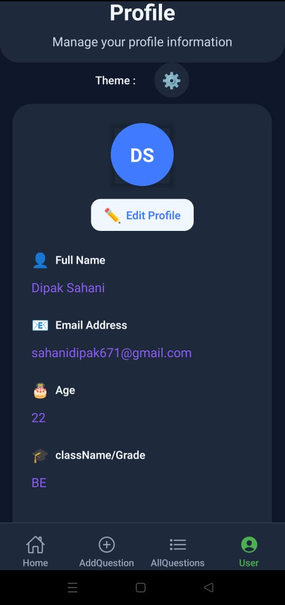
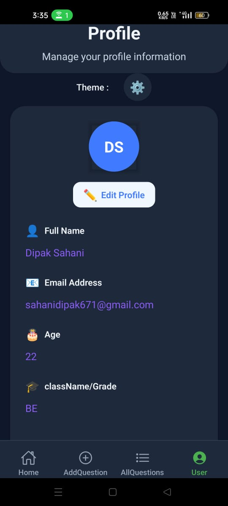
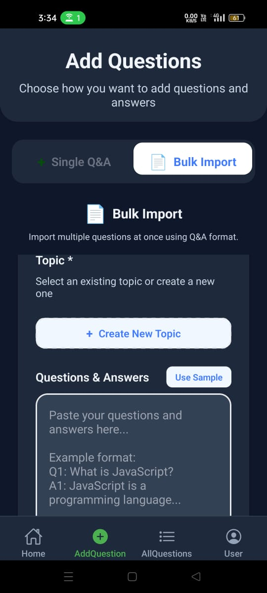
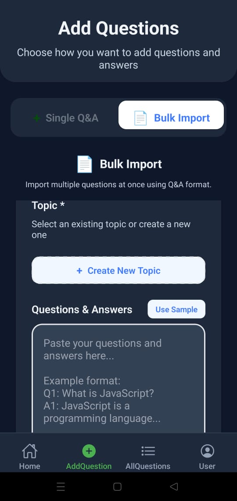
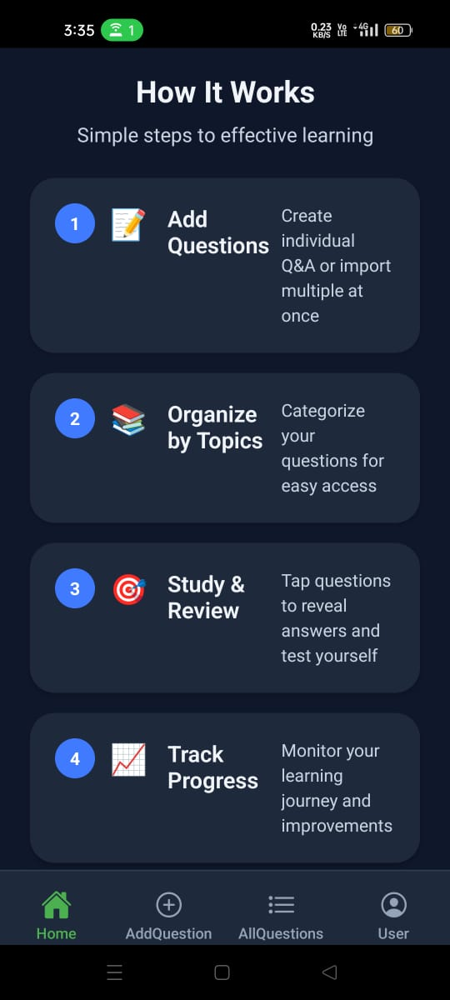
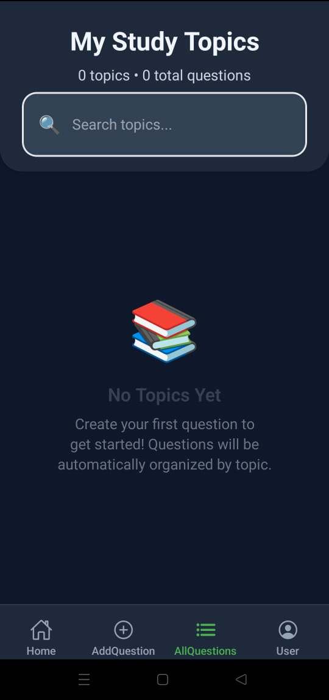
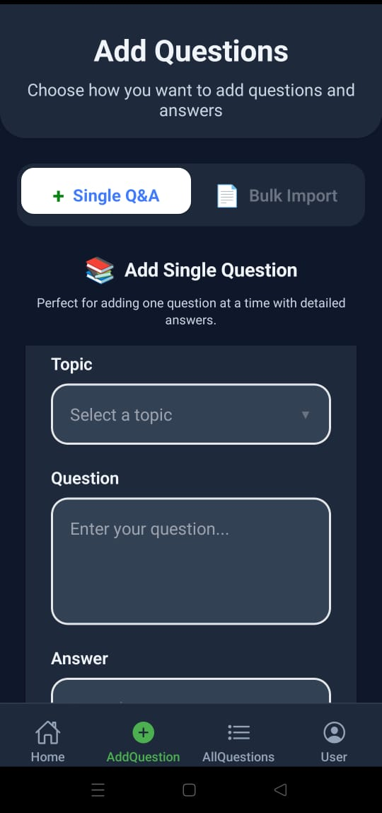

# Study Notes Pro 📚

A beautiful and intuitive React Native mobile application for creating, organizing, and studying question-answer notes. Perfect for students, learners, and anyone who wants to efficiently manage their study materials.

## ✨ Features

### 🎯 Core Functionality
- **Single Q&A Creation**: Add individual questions with detailed answers
- **Bulk Import**: Import multiple Q&A pairs at once using various formats (Q1/A1, Question/Answer, numbered lists)
- **Topic Organization**: Categorize questions by subjects (JavaScript, Math, Science, etc.)
- **Interactive Learning**: Tap to reveal answers - perfect for self-testing
- **Smart Search**: Find questions by content, answers, or topics
- **PDF Export**: Export your notes for offline studying

### 🎨 User Experience
- **Beautiful UI**: Modern design with smooth animations and intuitive navigation
- **Dark/Light Theme**: Full theme support with auto-detection
- **Responsive Design**: Optimized for both iOS and Android
- **Offline First**: All data stored locally using SQLite
- **Fast Performance**: Built with React Native and optimized components

### 📱 Screens
- **Home**: App overview with quick actions and feature explanations
- **Add Questions**: Two modes - single Q&A or bulk import
- **My Notes**: Browse questions by topics with expandable answers
- **User Profile**: Manage your profile and preferences

## Demo

## Screenshots











## 🛠️ Tech Stack
**Frontend:** React Native with TypeScript

**Navigation:** React Navigation (Bottom Tabs)

**Database:** SQLite for local storage

**Styling:** React Native StyleSheet with Theme System

**Icons:** React Native Vector Icons

**State Management:** React Context API

## 🚀 Getting Started

### Prerequisites
- Node.js (v14 or higher)
- React Native CLI
- iOS Simulator (Xcode) or Android Studio

### Installation
```bash
# Clone the repository
git clone https://github.com/yourusername/study-notes-pro.git

# Navigate to project directory
cd study-notes-pro

# Install dependencies
npm install

# Install iOS dependencies (for iOS development)
cd ios && pod install && cd ..

# Run the app
npx react-native run-ios    # For iOS
npx react-native run-android # For Android